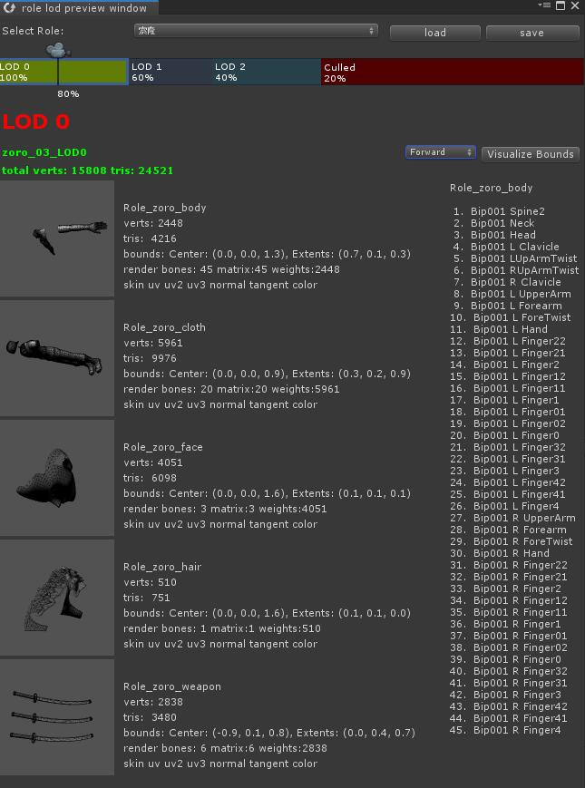

## LOD 工具

## 1. 自动减面工具 SimplyGon

[SimplyGon][i1] 是一个平台，利用它可对模型和纹理之类的 3D 素材进行不同目的的优化，无需手动操作（或仅需少量操作）。可使用 Simplygon 创建 LOD 链、减少绘制调用、将多个高精度模型组合为一个开销较低的模型、优化特定视角的场景、移除不可见几何体等。 不知道什么原因， [SimplyGon][i1]已经在AssetStore下架， 这对Unity开发者很不友好， 作者从第三方[论坛][i2]下载的版本，如涉侵权，联系作者。

[SimplyGon][i1]环境配置和使用教程， 参见[视频][i3]。

## 2. LOD 切换预览

算法： 计算avatar对应的包围盒（每个Mesh的bounds合成一个大的AB盒），然后根据包围盒的高度和屏幕高度百分比来切换lod.
 
  

__用法：__

菜单栏： Tools->RoleLOD, 打开窗口后， 把不同的lod的模型拖拽到编辑器对应的模块， 拖拽编辑器上的camera图标即可预览了。

这里只提供了编辑器版本，运行时需要考虑的更多：

* 1. 加入时间阻尼或者缓冲区， 来避免lod过于频繁切换
* 2. 高中低端机型适配，对于对端机型可能高模也只使用低lod的渲染方式
* 3. 材质也要分级， 高模部分使用复杂计算、效果多的材质， 低模使用简单的材质

## 联系方式

* 邮箱:  peng_huailiang@qq.com
* 博客:  https://penghuailiang.gitee.io

[i1]: https://80.lv/vendors/simplygon/
[i2]: https://forum.unity.com/threads/simplygon-login.498501/#post-3352846
[i3]: https://youtu.be/m1QRgzqeCxg
